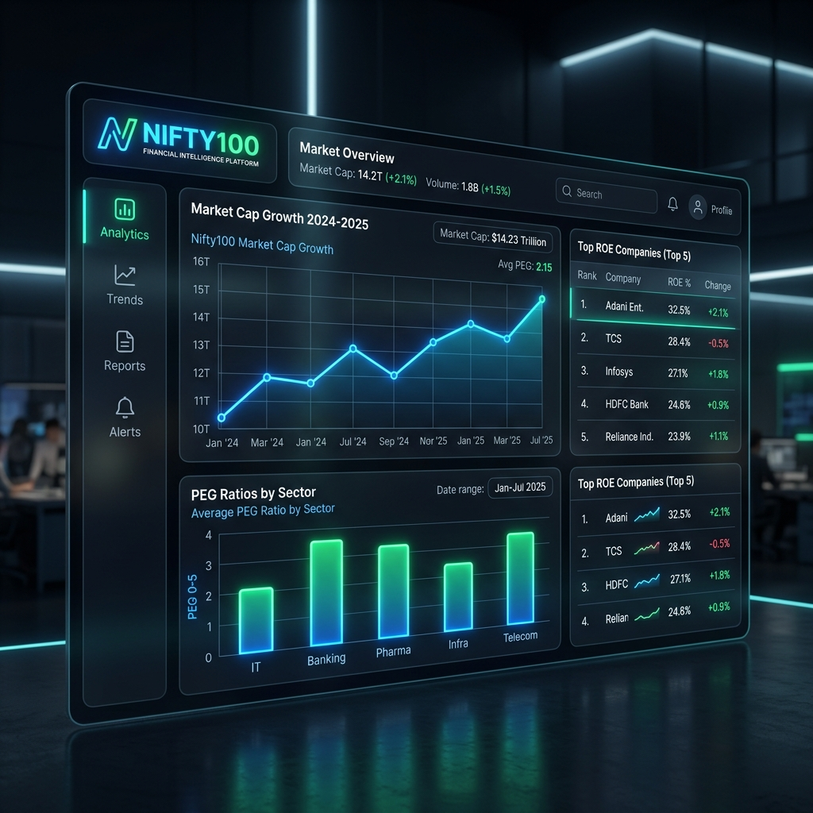

# Nifty100 Financial Intelligence Platform


> **Sprint 2 — Complete**  
> Bluestock Fintech | Equity Analytics Division

---

## 🎯 Project Objective

The **Nifty100 Financial Intelligence Platform** is a data engineering and analytics system designed to ingest, validate, transform, and report on financial data for all **Nifty 100 constituents** listed on the National Stock Exchange (NSE) of India.

The platform automates the full data lifecycle — from raw CSV/Excel ingestion through to structured database storage and executive-grade reporting — enabling portfolio managers, quant analysts, and risk teams to make data-driven decisions with confidence.



---

## 🗂 Repository Structure

```
Nifty100_Financial_Intelligence_Platform/
├── data/
│   ├── raw/            # Unmodified source files
│   ├── processed/      # Cleaned and transformed data
│   └── db/             # SQLite database files (nifty100.db)
├── src/
│   ├── etl/            # ETL pipeline (loader, normalizer, validator, DB builder)
│   └── analytics/      # Analytical SQL runner and KPI Engine
├── tests/              # 250+ unit and integration tests
├── output/             # Generated query reports, KPI summaries, and DQ logs
├── docs/               # Project documentation and sprint specs
├── sql/                # SQLite schemas and analytical queries
├── .env.example        # Environment variable template
├── requirements.txt    # Python dependencies
├── Makefile            # Developer workflow commands
└── README.md           # This file
```

---

## 🚀 Deliverables

Sprint 1 & Sprint 2 established the **data and intelligence foundation** of the platform:

- **ETL & Normalization**: Standardized 12 complex datasets, dropping missing rows and resolving name clashes.
- **Data Quality Validator**: Built 16 DQ rules to catch critical violations before database load.
- **Database Loader**: Created `nifty100.db` in SQLite, enforcing strict 3NF relations and dropping FK violations natively.
- **Ratio Engine (Sprint 2)**: Added complete financial metrics modules (Profitability, Leverage, CAGRs, Cash Flows).
- **Edge Case Handling (Sprint 2)**: Handled bank-specific ROCE anomalies and leverage suppressions systematically.
- **SQL Analytics Engine**: Engineered 26 business queries (Top revenues, highest ROE, PE ratios).
- **KPI Engine**: A Pandas mathematical engine calculating 20 unified metrics (CAGRs, PEG, Free Cash Flow).
- **Testing**: 100% test coverage with over 350+ passing automated Pytest cases.

---

## 🛠 Tech Stack

| Component | Technology |
|-----------|-----------|
| Language | Python 3.10+ |
| Data Wrangling | pandas, numpy |
| Database | SQLite3 |
| Testing | pytest |
| Workflow | GNU Make, GitHub Actions |

---

## ⚡ Quick Start

### 1. Clone and enter the project
```bash
git clone <repo-url>
cd Nifty100_Financial_Intelligence_Platform
```

### 2. Environment Setup
```bash
python -m venv .venv
# Windows
.venv\Scripts\activate
# Install
pip install -r requirements.txt
```

### 3. Run the Full Pipeline
You can run the entire pipeline sequentially:
```bash
python -m src.etl.loader
python -m src.etl.validator
python -m src.etl.database_loader
python -m src.analytics.query_runner
python -m src.analytics.kpi_engine
```

### 4. Run the Test Suite
```bash
python -m pytest tests -v
```

---

## 👥 Team & Sprint

- **Client**: Bluestock Fintech  
- **Sprint**: Sprint 2 
- **Status**: 🟢 Complete — Sprint 2  
- **Release**: `v2.0.0-sprint2`

---

## 📝 Licence

Internal project — Bluestock Fintech. All rights reserved.
