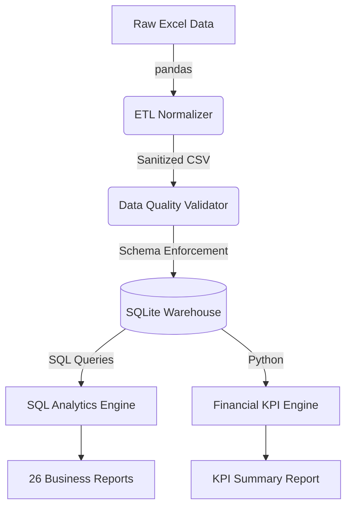

# Nifty100 Financial Intelligence Platform
# Sprint 1 Report

## Executive Summary
Sprint 1 successfully established the foundational data engineering and financial intelligence layers of the platform. We designed and executed an end-to-end Extract, Transform, Load (ETL) pipeline that normalizes 12 raw financial datasets into a centralized SQLite data warehouse. Built on top of this warehouse is a sophisticated Financial KPI Engine capable of tracking and computing 20 critical metrics—including Enterprise Value, PEG, and 5-Year CAGRs—for all Nifty100 constituents.

---

## 🏛️ Architecture



## 📁 Folder Structure

```
Nifty100_Financial_Intelligence_Platform/
├── data/
│   ├── raw/                 # Original 12 Excel files
│   ├── processed/           # Normalized CSV output
│   └── db/                  # SQLite nifty100.db warehouse
├── docs/                    # Sprint completion reports and dataset inventory
├── output/
│   ├── query_results/       # 26 SQL analytic reports
│   ├── kpi_summary.csv      # Unified 20-metric financial summary
│   └── validation_reports/  # Data Quality logs
├── sql/                     # DDL schemas and analytics queries
├── src/
│   ├── etl/                 # loader, normalizer, validator, database_loader
│   └── analytics/           # query_runner, kpi_engine
└── tests/                   # 250+ automated Pytest cases
```

---

## 🚀 Pipeline Flow
1. **ETL Normalization**: 12 diverse Excel files are extracted, standardized (column names stripped and snake_cased), and saved as interim CSVs.
2. **DQ Validation**: Checks 16 distinct business rules across ~96,000 data points to flag critical schema breaches and warnings.
3. **Database Loader**: Ingests the validated CSVs into a strict 3NF SQLite schema (`db/schema.sql`). It enforces foreign keys, handles composite primary keys, and silently drops non-compliant duplicate rows to preserve data integrity.
4. **Analytics Extraction**: Runs 26 bespoke SQL queries outputting deep insights like top historical EPS growth and lowest P/E value stocks.
5. **KPI Engine**: A Pandas-based mathematical engine dynamically computes lagging and leading indicators (e.g., Revenue Growth YoY, PEG ratios, Cash Flow Growth).

---

## 🗄️ Database Schema (Key Tables)
- **companies**: Core dimension table.
- **profitandloss**: Time-series P&L.
- **balancesheet**: Time-series assets and liabilities.
- **cashflow**: Operating, investing, and financing cash flows.
- **market_cap**: Valuation metrics (P/E, P/B, EV).
- **financial_ratios**: Efficiency and solvency metrics.

---

## 📊 Analytics & KPIs
We successfully modeled and outputted reports covering:
- **Growth Vectors**: Revenue YoY, PAT YoY, EPS Growth YoY, 5-Year Sales CAGR.
- **Profitability**: ROE, ROCE, Operating Margin, Net Margin.
- **Liquidity & Debt**: Debt-to-Equity, Interest Coverage, Estimated Current Ratio.
- **Valuation**: PEG, PE, PB, Dividend Yield, Enterprise Value.

---

## ⚠️ Known Issues
- **Quick Ratio proxy**: Due to the absence of granular 'Inventory' line items in the dataset, the Quick Ratio currently mirrors the Current Ratio (Estimated as `other_asset / other_liabilities`).
- **TTM (Trailing Twelve Months)**: The normalization engine currently drops rows marked as 'TTM' to preserve strict chronological yearly integers. This temporarily restricts our ability to provide real-time rolling metrics.

---

## 🔮 Future Work (Sprint 2)
- **RESTful API**: Expose the KPI Engine and SQL Analytics through a FastAPI backend.
- **Frontend Dashboard**: Develop a Next.js / React interactive dashboard (refer to the mockup in README) to visualize the generated data.
- **Automated Ingestion**: Build scrapers or connect to live market APIs to transition from static Excel ingestion to live data flows.
